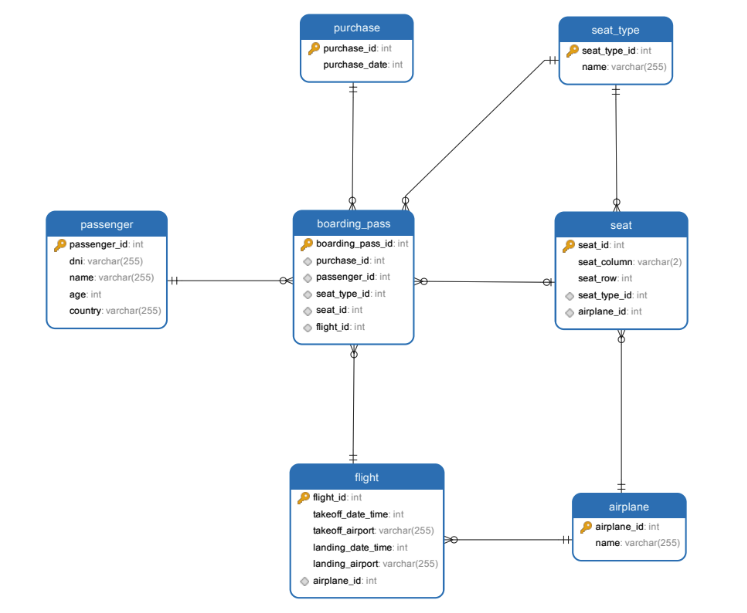

# Ejercicio de postulacion al puesto de desarrollador de bsale

## **Como ejecutar la API**

1. Clona este repositorio con el siguiente comando:

    `git clone https://github.com/pgg11/ejercicio-postulacion-bsale.git`

    Al ejecutar el comando, Git descargará una copia completa del repositorio en tu directorio actual. Puedes especificar una ruta de destino después de la URL del repositorio si deseas clonar el repositorio en una ubicación específica.

2. Instalación de dependencias:

    Debes tener instalado Node.js en tu computadora. Puedes descargarlo e instalarlo desde el sitio oficial de Node.js.

    Asegúrate de estar en el directorio raíz del repositorio, donde se encuentra el archivo package.json, y sigue estos pasos
    
    - Abre una terminal en el directorio raíz.
    - Ejecuta el siguiente comando:

        `npm install`

        Esto iniciará el proceso de instalación de las dependencias listadas en el archivo package.json. npm descargará los paquetes necesarios y los almacenará en una carpeta llamada node_modules en el directorio de tu proyecto.

3. Ejecuta la aplicación con el siguiente comando:

    `npm start`

    Después de ejecutar el comando de inicio, la API debería comenzar a ejecutarse y mostrar mensajes en la terminal que indican que está en funcionamiento. 

---

## **SOLUCIÓN PROPUESTA**

La solución consiste en traer de la base de datos la información necesaria para tener los datos del vuelo, los pasajeros con check in ya realizado(discriminado por la clase de asiento cada uno), los asientos con los que cuenta cada clase y una lista con todos los pasajeros.

Después de contar con la información, haciendo uso de las funciones para dar formatos a los datos(***"dataFormatting.js"***), se deja preparada la información del vuelo en notación camelCase para la posterior respuesta de la API, se genera un array con la lista completa de los pasajeros con la misma notación, un array por cada clase de asientos con su respectiva información, y un array por cada clase con los pasajeros que ya hicieron el check in.

Luego se agrupan los tres arrays de pasajeros por clase con check in realizado en un array general de pasajeros, y los tres arrays de asientos por clase en un array general de asientos, para ser utilizados posteriormente en la función que asigna los asientos a los pasajeros restantes. Esta función toma como parametros, la lista completa de pasajeros, un array de pasajeros por clase(divididos en arrays) y un array con la lista de asientos dividos por clase.

La función que asigna los asientos primero quita por clase los asientos ocupados, luego recorre la lista de pasajeros completa, y por cada pasajero que no tiene asiento asignado, si existen otros pasajeros con mismo id de compra que tiene asiento asignado, intenta primero sentar al pasajero al lado de alguno de sus compañeros de viaje en la misma fila, si no hay asiento disponible en la misma fila, intenta ubicarlo en la misma columna. Finalmente vuelve a recorrer la lista de pasajeros completa para ubicar a los pasajeros que tenían id de compra individual, se agrega el atributo **"passengers"** al objeto flightInfo que contenía la información del vuelo, con la lista de pasajeros con todos los asientos asignados.

---

## **utils**

Dentro de la carpeta utils hay dos archivos, uno con las funciones para dar formato camelCase a las respuestas de las consultas a la base de datos y otro archivo con las funciones para la asignación de asientos.

* Funciones de asignación de asiento 

    * automaticCheckIn: Funcion principal para asignar asientos.
    * findSeat: Dados el pasajero sin asiento, los asientos de la clase, los asientos disponibles de la clase y el pasajero con asiento asignado, le busca un asiento aledaño a su compañero.
    * getSameRowSeat: Dados un pasajero, los asientos de la clase, los asientos disponibles de la clase y el id del avion, busca un asiento en la misma fila del pasajero.
    * getSameColSeat: Dados un pasajero, los asientos de la clase, los asientos disponibles de la clase y el id del avion, busca un asiento en la misma columna del pasajero.
    * getNextColumn: Dados el nombre de la columna del asiento, el id del avion y la clase de asiento, devuelve la siguiente columna si es que existe o false de lo contrario.
    * getPreviousColumn: Dados el nombre de la columna del asiento, el id del avion y la clase de asiento, devuelve la columna anterior si es que existe o false de lo contrario.
    * getNextRow: Dados el numero de la fila del asiento y el id del avion, devuelve la siguiente fila si es que existe o false de lo contrario.
    * getPreviousRow: Dados el numero de la fila del asiento y el id del avion, devuelve la fila anterior si es que existe o false de lo contrario.
    * removeOccupiedSeats: Dados los asientos disponibles de una clase y un array de pasajeros, quita de los asientos disponibles, los asientos asignados a cada uno de los pasajeros del array.

---

## *Consultas a la base de datos*

***Todas las consultas son filtradas por id del vuelo***

- getFlightInfo: Trae la información del vuelo.
- getFlightPassengers: Trae la lista de todos los pasajeros con su id de pasajero, dni, nombre, edad, nacionalidad, id de la tarjeta de embarque, id de la compra, id del tipo de asiento(clase) e id del asiento.
- getFirstClassPassengers: Trae la lista de todos los pasajeros con asiento asignado de la primera clase.
- getSecondClassPassengers: Trae la lista de todos los pasajeros con asiento asignado de la clase económica premium.
- getThirdClassPassengers: Trae la lista de todos los pasajeros con asiento asignado de la clase economica.
- getFirstClassSeats: Trae la lista de todos los asientos de la primera clase.
- getSecondClassSeats: Trae la lista de todos los asientos de la clase económica premium.
- getThirdClassSeats: Trae la lista de todos los asientos de la clase económica.